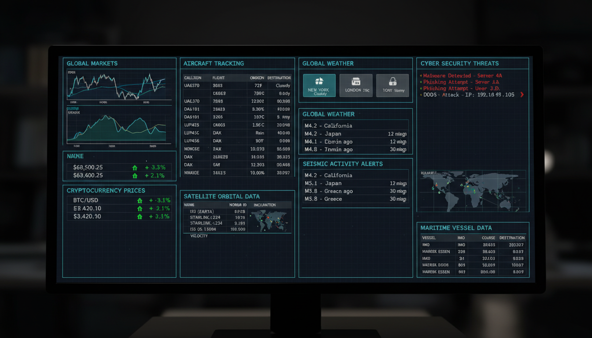
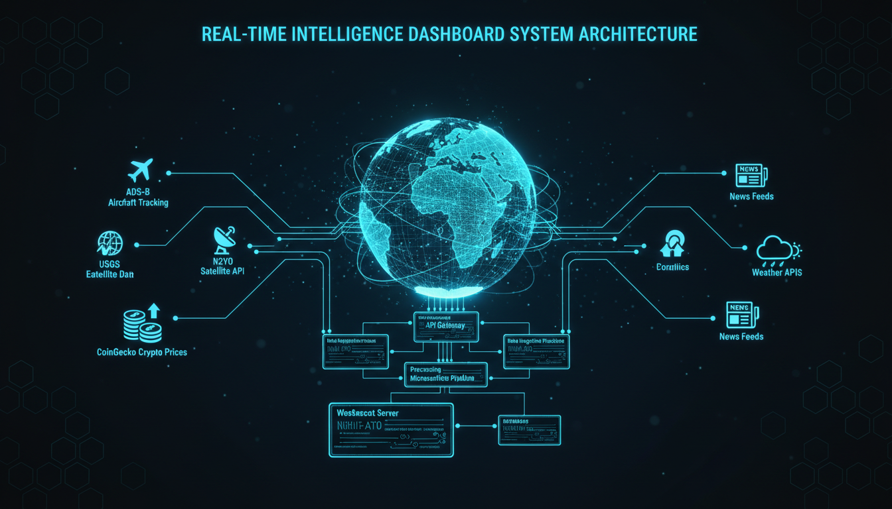
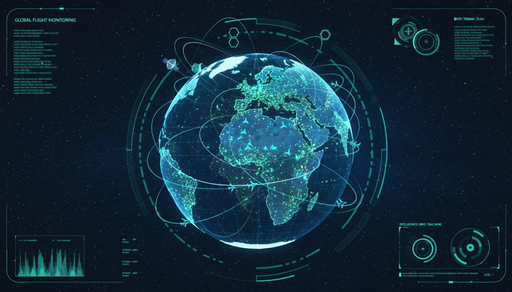

<div align="center">


# 🌍 WORLD MONITOR v2
## CLAWCHAN INTELLIGENCE AGENCY

[](https://www.typescriptlang.org/)
[](https://reactjs.org/)
[](https://threejs.org/)
[](https://vitejs.dev/)
[](https://tailwindcss.com/)

**Real-time Global Intelligence Dashboard with Bloomberg Terminal-style Interface**

[🌐 Live Demo](https://g5dg7g55gd4ze.ok.kimi.link) • [📊 Architecture](#architecture) • [🚀 Getting Started](#getting-started)

</div>

---

## 📊 Repository Statistics

| Metric | Value |
|--------|-------|
| **Total Files** | 84+ files |
| **TypeScript** | 49 files (Frontend + Node.js Backend) |
| **Python** | 2 files (ML Models) |
| **Go** | 2 files (Security + WebSocket) |
| **Rust** | 1 file (High-Performance Core) |
| **Java/Kotlin** | 2 files (Ingestion Service) |
| **Scala** | 1 file (Stream Analytics) |
| **C++** | 1 file (Ultra-Low-Latency Engine) |

---

## ✨ Features

### 🎯 11 Live Intelligence Widgets



| Widget | Description | Data Source |
|--------|-------------|-------------|
| 🌍 **Global Intelligence** | 3D Earth globe with Google Earth AI visualization | Three.js |
| ✈️ **ADS-B Tracking** | Real-time aircraft tracking (8,000+ aircraft) | ADS-B Exchange |
| 🛰️ **Satellite Tracking** | ISS, Starlink, GPS, HST, NOAA satellites | N2YO |
| 📈 **Global Markets** | S&P 500, Dow Jones, NASDAQ, VIX | Yahoo Finance |
| ₿ **Cryptocurrency** | BTC, ETH, SOL, XRP live prices | CoinGecko |
| 📰 **Intelligence Feed** | Multi-source news aggregation | Guardian API |
| 🌤️ **Global Weather** | 6 major cities weather monitoring | OpenWeatherMap |
| 🌋 **Seismic Monitor** | USGS earthquake alerts | USGS |
| 🛡️ **Cyber Security** | Threat intelligence & monitoring | Internal |
| 🚢 **Maritime AIS** | Vessel tracking worldwide | AIS |
| 📡 **SIGINT Collection** | Signal intelligence & frequency scanning | Internal |

---

## 🏗️ System Architecture



### Data Flow
```
┌─────────────────────────────────────────────────────────────────┐
│                     DATA SOURCES                                 │
├─────────────┬─────────────┬─────────────┬───────────────────────┤
│  ADS-B      │   N2YO      │   USGS      │   CoinGecko           │
│  Aircraft   │  Satellite  │ Earthquake  │   Crypto              │
└──────┬──────┴──────┬──────┴──────┬──────┴───────────┬───────────┘
       │             │             │                  │
       └─────────────┴──────┬──────┴──────────────────┘
                            │
                    ┌───────▼────────┐
                    │  API Gateway   │
                    └───────┬────────┘
                            │
        ┌───────────────────┼───────────────────┐
        │                   │                   │
┌───────▼──────┐  ┌────────▼────────┐  ┌──────▼──────┐
│   React      │  │   WebSocket     │  │   Data      │
│   Frontend   │  │   Server        │  │   Pipeline  │
└───────┬──────┘  └─────────────────┘  └─────────────┘
        │
┌───────▼─────────────────────────────────────────────┐
│              11 INTELLIGENCE WIDGETS                 │
│  ┌─────────┐ ┌─────────┐ ┌─────────┐ ┌─────────┐   │
│  │  Globe  │ │ Aircraft│ │Satellite│ │ Markets │   │
│  └─────────┘ └─────────┘ └─────────┘ └─────────┘   │
│  ┌─────────┐ ┌─────────┐ ┌─────────┐ ┌─────────┐   │
│  │  Crypto │ │  News   │ │ Weather │ │ Seismic │   │
│  └─────────┘ └─────────┘ └─────────┘ └─────────┘   │
│  ┌─────────┐ ┌─────────┐ ┌─────────┐               │
│  │ Security│ │ Maritime│ │ SIGINT  │               │
│  └─────────┘ └─────────┘ └─────────┘               │
└─────────────────────────────────────────────────────┘
```

---

## 🌐 3D Globe Visualization



### Globe Features
- 🌍 **Earth Sphere** - Realistic planet with atmosphere glow
- 🔄 **OrbitControls** - Drag/rotate with mouse
- ✈️ **Aircraft Markers** - 8+ aircraft with glow effects
- 🛰️ **Satellite Markers** - 6+ satellites with orbit trails
- 📊 **Stats Overlay** - Live tracking counts

---

## 🎨 Bloomberg Terminal UI

### Design Features
- ✅ **Grid Layout** - 4-column responsive widget system
- ✅ **Navigation Tabs** - ALL, INTEL, TRACKING, FINANCE, SECURITY
- ✅ **Live Indicators** - Green pulsing dots on all widgets
- ✅ **Status Bar** - Real-time system metrics & data sources
- ✅ **Dark Theme** - Professional terminal aesthetic

---

## 🛠️ Tech Stack

### Frontend
```
React 18 + TypeScript + Vite + Tailwind CSS + Three.js
```

### State Management
```
Zustand (lightweight, fast, no boilerplate)
```

### 3D Visualization
```
Three.js + React Three Fiber + OrbitControls
```

### Icons
```
Lucide React (beautiful, consistent icon set)
```

---

## 📁 Project Structure

```
📦 World-Monitor-Clawchan-Intelligence
├── 📁 backend/              # API servers & microservices
│   ├── api-gateway/         # Central API routing
│   ├── websocket-server/    # Real-time data streaming
│   └── data-ingestion/      # Data collection services
├── 📁 config/               # Configuration files
├── 📁 docs/                 # Documentation
│   └── 📁 architecture/     # Visual architecture diagrams
│       ├── dashboard-hero.png
│       ├── system-architecture.png
│       ├── globe-visualization.png
│       └── widgets-grid.png
├── 📁 frontend/             # React frontend application
│   └── src/
│       ├── components/
│       │   ├── widgets/     # 11 intelligence widgets
│       │   │   ├── GlobeWidget.tsx
│       │   │   ├── AircraftWidget.tsx
│       │   │   ├── SatelliteWidget.tsx
│       │   │   ├── MarketWidget.tsx
│       │   │   ├── CryptoWidget.tsx
│       │   │   ├── NewsWidget.tsx
│       │   │   ├── WeatherWidget.tsx
│       │   │   ├── SeismicWidget.tsx
│       │   │   ├── SecurityWidget.tsx
│       │   │   ├── MaritimeWidget.tsx
│       │   │   └── SigintWidget.tsx
│       │   ├── ui/          # shadcn/ui components
│       │   ├── DashboardLayout.tsx
│       │   └── StatusBar.tsx
│       ├── store/           # Zustand state management
│       ├── api/             # API integrations
│       └── hooks/           # Custom React hooks
├── 📁 infra/                # Infrastructure & deployment
├── 📁 ml/                   # Machine learning models
├── 📁 scripts/              # Utility scripts
├── 📁 security/             # Security configurations
└── 📁 tests/                # Test suites
```

---

## 🚀 Getting Started

### Prerequisites
- Node.js 18+
- npm or yarn

### Installation

```bash
# Clone repository
git clone https://github.com/blackdragonspear62/World-Monitor-Clawchan-Intelligence.git
cd World-Monitor-Clawchan-Intelligence

# Install dependencies
cd frontend
npm install

# Start development server
npm run dev
```

### Build for Production

```bash
npm run build
```

---

## 📡 Data Sources

| Source | Data Type | API Endpoint |
|--------|-----------|--------------|
| USGS | Earthquakes | `https://earthquake.usgs.gov/fdsnws/event/1/` |
| ADS-B Exchange | Aircraft | `https://api.adsbexchange.com/` |
| N2YO | Satellites | `https://api.n2yo.com/rest/v1/` |
| CoinGecko | Crypto | `https://api.coingecko.com/api/v3/` |
| OpenWeatherMap | Weather | `https://api.openweathermap.org/data/2.5/` |
| The Guardian | News | `https://content.guardianapis.com/` |

---

## 🎯 Widget Details

### GlobeWidget
- Three.js 3D globe with wireframe overlay
- Auto-rotating animation
- 150+ data points visualization
- Atmosphere glow effect

### AircraftWidget
- Live aircraft count: 8,000+
- ADS-B Exchange integration
- Callsign, altitude, heading display
- Real-time position updates

### SatelliteWidget
- ISS, Starlink, HST, GPS tracking
- N2YO data source
- NORAD ID display
- Altitude & velocity metrics

### MarketWidget
- S&P 500, Dow Jones, NASDAQ, VIX
- Real-time price updates
- Green/red change indicators
- Volume display

### CryptoWidget
- BTC, ETH, SOL, XRP prices
- 24h percentage changes
- CoinGecko API integration
- Market cap display

### NewsWidget
- Multi-source aggregation
- Category badges (geopolitics, military, tech, finance, disaster)
- Guardian API integration
- Real-time feed

### WeatherWidget
- Multi-city weather display
- Temperature, humidity, wind speed
- Weather condition icons
- OpenWeatherMap API

### SeismicWidget
- USGS earthquake monitoring
- Magnitude alerts (green/yellow/orange/red)
- Location & depth tracking
- Real-time event feed

### SecurityWidget
- Cyber threat intelligence
- Active threat monitoring
- DDoS, phishing, malware detection
- Real-time alerts

### MaritimeWidget
- AIS vessel tracking
- Cargo, tanker, passenger ships
- Speed & heading display
- Global coverage

### SigintWidget
- Signal intelligence collection
- Frequency scanning
- Encrypted signal detection
- Real-time intercepts

---

## 📝 License

MIT License - See [LICENSE](LICENSE) for details.

---

<div align="center">

**Built with ❤️ by Clawchan Intelligence Agency**

[🌐 Live Demo](https://g5dg7g55gd4ze.ok.kimi.link) • [📊 GitHub](https://github.com/blackdragonspear62/World-Monitor-Clawchan-Intelligence)

</div>
